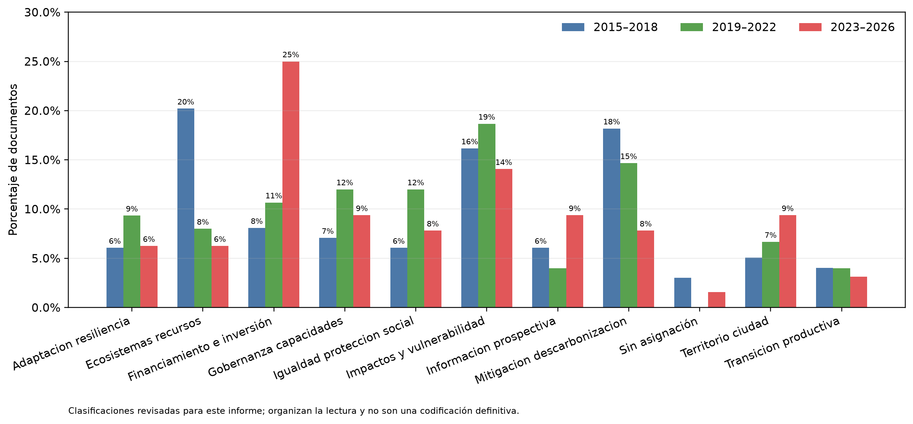
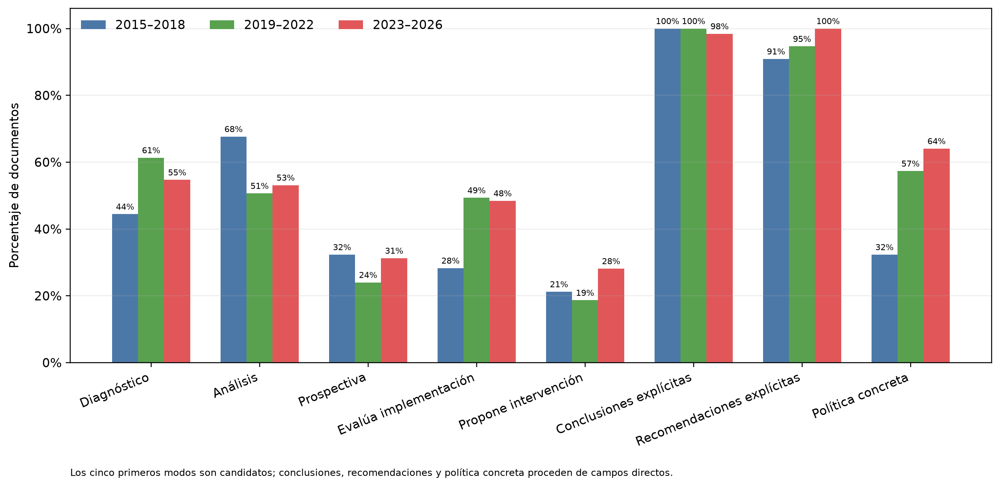
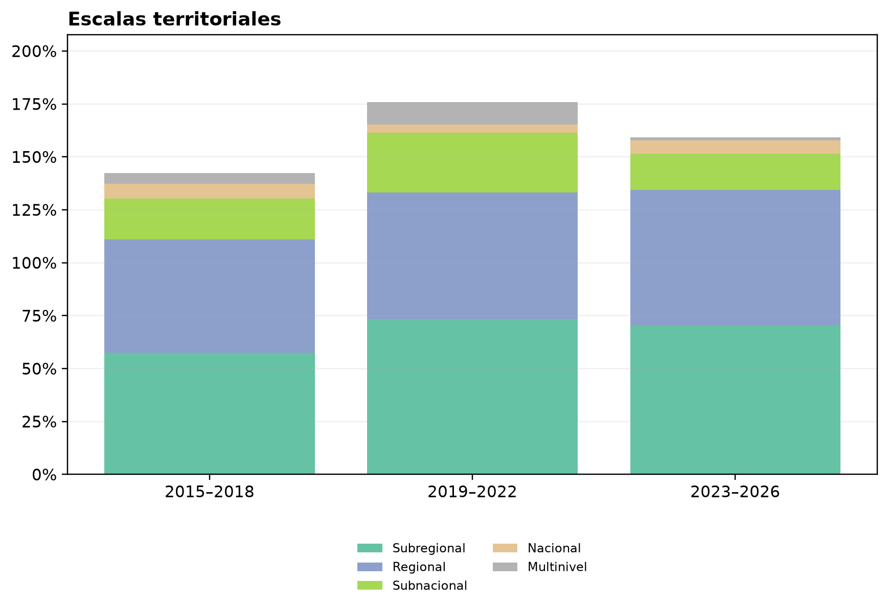
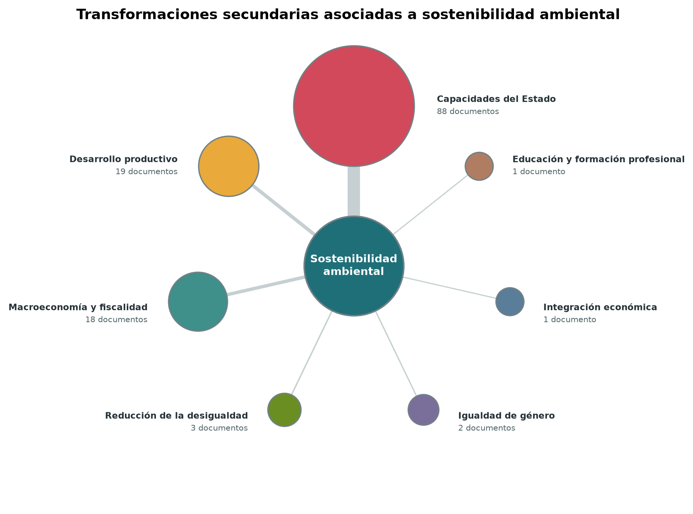
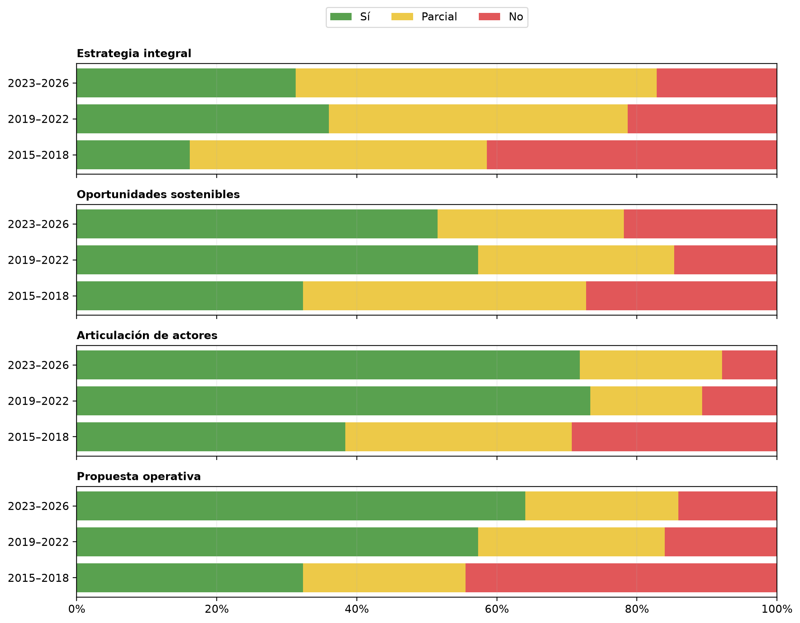

# Evolución del abordaje CEPAL sobre cambio climático

**Borrador v2 para revisión editorial.** El informe examina 238 publicaciones activas de la CEPAL entre 2015 y 2026. Para ordenar la comparación, distingue un primer período (2015–2018), un período intermedio (2019–2022) y un período reciente (2023–2026), que incluye seis publicaciones fechadas en 2026.

## Resumen ejecutivo

Este informe analiza cómo la CEPAL ha formulado el cambio climático como un problema de desarrollo durante 2015–2026. El corpus reúne 238 publicaciones activas y no representa una muestra neutral de toda la literatura climática regional: reconstruye la producción institucional de la CEPAL. Esta precisión es central para interpretar los resultados. Desarrollo Sostenible y Asentamientos Humanos concentra 122 documentos, y el conjunto contiene 148 estudios técnicos, 27 policy briefs, 25 informes y otras categorías normalizadas. Las diferencias entre períodos pueden reflejar cambios de enfoque, pero también variaciones en los tipos de publicación, las divisiones y las escalas de trabajo.

La lectura parte de documentos completos: pregunta de investigación, ámbito, resumen, hallazgos, conclusiones y recomendaciones. Las clasificaciones revisadas para este informe organizan la lectura y no constituyen una codificación definitiva; los paneles de interpelación, las conclusiones y las recomendaciones son capas complementarias. Las citas se usan selectivamente para verificar definiciones, tensiones y mecanismos relevantes. El informe no mide resultados de políticas ni demuestra causalidad: identifica patrones en cómo la CEPAL diagnostica problemas, formula instrumentos y delimita condiciones de implementación.

Cinco hallazgos organizan la síntesis. Primero, el cambio climático aparece como una cuestión a la vez biofísica, territorial, social y económica. Impactos en agua, agricultura, costas, ecosistemas, energía, infraestructura y ciudades se relacionan con desigualdad, dependencia de recursos, información insuficiente y capacidad estatal. La vulnerabilidad no se presenta como un atributo fijo de los territorios, sino como el resultado de interacciones entre exposición, estructura productiva, recursos y posibilidad de respuesta.

Segundo, el corpus muestra un cambio de énfasis, no una sucesión de etapas cerradas. 2015–2018 conserva una base fuerte de impactos, adaptación, mitigación y ecosistemas. 2019–2022 vuelve más visible la recuperación sostenible como articulación entre inversión, protección social, transformación productiva y coordinación. 2023–2026 da mayor presencia a financiamiento e inversión climática, datos, infraestructura resiliente, capacidades de ejecución y distribución de los costos de la transición. Los impactos y la vulnerabilidad persisten en todos los períodos; por eso, la evolución se interpreta como una modificación de las conexiones entre problemas, instrumentos y condiciones de acción.

Tercero, los instrumentos climáticos no aparecen como medidas aisladas. El corpus vincula fiscalidad, financiamiento, regulación, planificación, información, innovación y protección social con sectores y territorios específicos. Las herramientas de análisis, como escenarios, valoración económica, indicadores, modelos e información geoespacial, ayudan a priorizar decisiones, pero no reemplazan el juicio público, el financiamiento ni la coordinación institucional. Su presencia documental no equivale a adopción o eficacia comprobada.

Cuarto, la brecha más persistente está entre el diseño y la ejecución. Planes, normas y recomendaciones requieren capacidades técnicas y subnacionales, datos, financiamiento previsible, sistemas de inversión pública y coordinación intersectorial. La inversión no es solo una fuente de recursos: es el punto donde se decide si los criterios de resiliencia, reducción de riesgo, igualdad y sostenibilidad entran efectivamente en proyectos, presupuestos y prioridades territoriales.

Quinto, el Gran Impulso Ambiental permite diferenciar oportunidades sectoriales de estrategias de transformación. Energía, bioeconomía, movilidad, circularidad e infraestructura resiliente se aproximan a un cambio estructural cuando combinan inversiones complementarias, expansión de mercados bajos en carbono, capacidades, instrumentos públicos y atención a la distribución de costos y beneficios. El panel de interpelación muestra más articulación de actores y propuestas operativas en 2019–2022 y 2023–2026 que en 2015–2018, pero el estándar de una estrategia integral sigue siendo más exigente que el de una oportunidad o recomendación sectorial.

La participación pública completa esta lectura. El informe la trata cualitativamente, como relación entre acceso a información, justicia ambiental, igualdad y capacidad de intervenir en decisiones que afectan a grupos y territorios expuestos. No existe en el corpus una anotación validada que permita medir calidad o incidencia vinculante de la participación climática. El enfoque de género se mantiene como ejemplo sectorial dentro de igualdad, adaptación y territorio: muestra que la inclusión depende de quién participa, en qué momento y con qué recursos.

La agenda sustantiva que surge del informe se concentra en vincular los objetivos climáticos con financiamiento asequible, inversión pública, coordinación institucional, capacidades territoriales, datos para el seguimiento, igualdad y derechos de acceso. El desafío no consiste únicamente en ampliar instrumentos: exige que puedan operar de manera sostenida en los territorios y distribuir de forma justa costos, riesgos y beneficios.

## 1. Introducción: un corpus para leer una agenda institucional

Este informe examina cómo la CEPAL abordó el cambio climático entre 2015 y 2026 a partir de 238 publicaciones activas. No trata ese conjunto como una muestra neutral de toda la investigación climática de América Latina y el Caribe. Es, ante todo, un registro de la agenda intelectual e institucional de la organización: de los problemas que decidió documentar, las escalas en que trabajó y los instrumentos que consideró relevantes.

Esa precaución cambia la lectura de los agregados. Desarrollo Sostenible y Asentamientos Humanos concentra 122 de los 238 documentos; la distribución también responde a las contribuciones de las sedes de México y Puerto España. La normalización documental identifica 148 estudios técnicos, 27 policy briefs y 25 informes. Los documentos de mayor alcance institucional pueden ordenar una tesis de largo plazo, pero no deben imponerse como representación automática de la experiencia territorial ni desplazar los estudios técnicos que la detallan.

La unidad de lectura es el documento completo: su pregunta, ámbito, resumen, hallazgos, conclusiones y recomendaciones. Las citas de sección cumplen otra función: verificar definiciones, tensiones y mecanismos cuando esos elementos son decisivos para el argumento. Esta combinación permite seguir tanto la amplitud del corpus como el razonamiento de los textos que formulan sus propuestas con mayor precisión.

## 2. Corpus, método y límites

El análisis parte de publicaciones completas, considerando sus preguntas, ámbitos, hallazgos, conclusiones y recomendaciones. Las clasificaciones de objeto, territorio y tipología organizan la lectura, pero no reemplazan la interpretación de cada documento. Las citas se usan de manera selectiva para sostener definiciones y mecanismos decisivos. El informe identifica patrones en la agenda institucional de la CEPAL y no estima consenso regional, adopción, eficacia ni causalidad de políticas.

La comparación usa tres ventanas de calendario: 2015–2018, 2019–2022 y 2023–2026. El corpus comienza en 2015, año del Acuerdo de París, y los intervalos de aproximadamente cuatro años permiten comparar bloques de tamaño razonable y seguir una evolución legible. No son etapas derivadas automáticamente del contenido ni de un único evento. Sus denominadores son desiguales (99, 75 y 64 documentos) y el período más reciente sigue abierto, con seis publicaciones de 2026. Por eso, las diferencias se interpretan como cambios de énfasis que también pueden reflejar composición documental, tipos de publicación y divisiones institucionales.

## 3. Evolución del objeto de estudio

La evolución que aparece en el corpus no describe tres etapas cerradas. En **2015–2018**, los impactos físicos, los ecosistemas, la mitigación y la adaptación estructuran una base que no desaparece después. Los documentos estudian costas, agua, agricultura, biodiversidad, emisiones y vulnerabilidades territoriales, y muestran que la exposición climática se vuelve crítica cuando se combina con desigualdad, dependencia de recursos, infraestructura insuficiente y capacidades limitadas. La adaptación se presenta desde entonces como problema de desarrollo, información, financiamiento y coordinación, no como una respuesta ambiental aislada.

En **2019–2022**, la pandemia crea una ventana documental específica: recuperación sostenible, inversión, protección social, digitalización y transición productiva aparecen conectadas dentro de una misma discusión. *Construir un nuevo futuro: una recuperación transformadora con igualdad y sostenibilidad* no atribuye ese giro exclusivamente a la crisis sanitaria: “La percepción de que el sendero predominante de desarrollo era insostenible, de que había alcanzado sus límites y de que se estaba ante un cambio de época es anterior a la pandemia” (*Construir un nuevo futuro: una recuperación transformadora con igualdad y sostenibilidad*, 2020, p. 20). La recuperación funciona así como catalizador de una agenda previa, no como su origen único.

En **2023–2026 (período abierto, con seis publicaciones fechadas en 2026)**, la atención se concentra con mayor frecuencia en financiamiento e inversión climática, capacidades de ejecución, datos, infraestructura resiliente y distribución de los costos de la transición. La transición justa vuelve visible el vínculo entre empleo, protección social, desarrollo productivo e inclusión laboral. Este desplazamiento no elimina las bases anteriores: persisten vulnerabilidad, impactos y necesidades de adaptación. Por eso la tesis del informe es un cambio de énfasis y de articulación entre problemas, no una sustitución lineal de un tema por otro.

Las Figuras 1 y 2 organizan esta comparación sin convertir la clasificación en un hecho cerrado. La primera presenta objetos principales revisados para este informe; la segunda distingue los modos analíticos de las conclusiones, recomendaciones e interpelaciones que proceden directamente de los documentos. Juntas permiten preguntar qué se vuelve más visible y con qué evidencia, no proclamar una trayectoria uniforme.

*Figura 1. La comparación presenta proporciones de objetos principales candidatos por período; no equivale a una codificación experta exhaustiva.*

*Figura 2. Los cinco primeros modos son candidatos; conclusiones, recomendaciones y política concreta proceden de campos directos de los documentos.*

## 4. Impactos, diagnóstico y herramientas para decidir

El punto de partida del corpus es que el cambio climático modifica condiciones materiales de vida y de producción en territorios concretos. Los impactos no se presentan como un dato físico que pueda separarse de la estructura social, de los recursos disponibles o de la capacidad pública de respuesta. Agua, agricultura, costas, energía, infraestructura y ciudades aparecen como ámbitos donde una amenaza climática se vuelve riesgo cuando coincide con exposición, desigualdad y déficits de información o inversión.

El estudio sobre los ríos de Mendoza y San Juan ofrece una escena territorial precisa. “En la actualidad la tendencia al aumento de la temperatura está alterando el hidrograma de los ríos andinos…” (*Impactos y vulnerabilidad al cambio climático de los principales ríos de Mendoza y San Juan*, 2015, p. 16). La cita no permite extender mecánicamente un resultado hidrológico subnacional a toda la región, pero sí muestra el tipo de vínculo que el corpus documenta: los cambios climáticos alteran sistemas biofísicos de los que dependen actividades económicas, poblaciones y decisiones de infraestructura.

Este encadenamiento importa porque desplaza la pregunta desde la ocurrencia de una amenaza hacia la manera en que se distribuye el riesgo. Una variación en la disponibilidad de agua puede afectar al mismo tiempo abastecimiento, producción agrícola, generación eléctrica y mantenimiento de infraestructura. Sus consecuencias dependen de los márgenes de adaptación de hogares, empresas, gobiernos locales y organismos sectoriales. Así, el diagnóstico climático que recorre el corpus no se limita a registrar daños potenciales: busca reconocer qué relaciones entre ecosistemas, actividades y desigualdades deben entrar en la decisión pública.

El diagnóstico se prolonga en las condiciones de transformación. En el caso de la bioeconomía, la restricción no es únicamente tecnológica: “La falta de recursos de financiamiento es una restricción a la innovación en América Latina, especialmente en nuevos ámbitos, como la bioeconomía” (*Hacia una bioeconomía sostenible en América Latina y el Caribe*, 2019, p. 18). El caso ilustra que la respuesta climática requiere conectar oportunidades productivas con financiamiento, instituciones y capacidades. No demuestra que todas las innovaciones enfrenten la misma restricción, pero ayuda a explicar por qué el corpus desplaza la discusión desde el problema ambiental aislado hacia los medios de implementación.

Las herramientas analíticas ocupan un lugar intermedio entre diagnóstico y acción. Escenarios, modelos, valoración económica, indicadores, información geoespacial y sistemas de monitoreo permiten identificar alternativas y ordenar prioridades. El documento metodológico aplicado a Guatemala propone “desarrollar la valoración económica de los planes estratégicos institucionales de reducción de vulnerabilidad, adaptación y mitigación al cambio climático” (*Metodologías para apoyar la estimación de costos en Guatemala*, 2017, p. 85). La recomendación pone de relieve que una herramienta no decide por sí misma: aporta una base para deliberar sobre inversión pública, costos, fuentes de financiamiento y secuencia de medidas.

La distinción es decisiva para interpretar la creciente presencia de datos y herramientas en el período reciente. Un modelo puede comparar escenarios; un indicador puede hacer visible una brecha; una valoración puede hacer explícitos costos antes omitidos. Ninguno resuelve por sí mismo el conflicto entre usos alternativos de recursos, ni determina quién asume el costo de una medida o quién recibe primero su protección. La utilidad de estos instrumentos depende de que sus supuestos sean discutibles, sus resultados sean inteligibles para quienes deciden y existan instituciones capaces de incorporarlos en presupuestos, proyectos y mecanismos de seguimiento.

Por eso, el corpus no opone conocimiento técnico y decisión política. Los vincula en una secuencia: producir información pertinente, priorizar inversiones, definir responsabilidades, ejecutar y aprender de lo ejecutado. La secuencia tampoco es automática. La ausencia de datos comparables, la incertidumbre sobre impactos y la capacidad desigual de producir información pueden reproducir sesgos territoriales si solo se financia aquello que ya puede medirse con facilidad. El valor del diagnóstico consiste, precisamente, en hacer visibles esas decisiones y no en prometer una neutralidad inexistente.

## 5. Instrumentos, ejecución y desafíos de implementación

El corpus describe instrumentos fiscales, financieros, regulatorios, tecnológicos y de planificación como partes de conjuntos de política. En lugar de tratar la inversión como consecuencia automática de un diagnóstico climático, los textos preguntan cómo orientar incentivos, recursos y capacidades hacia actividades compatibles con sostenibilidad e igualdad. En un documento de recuperación sostenible, la formulación es directa: “Es necesario orientar los rendimientos de la inversión, palanca del cambio estructural, en la dirección correcta mediante los instrumentos de política pública” (*Cómo financiar el desarrollo sostenible*, 2022, p. 22).

Esta perspectiva permite leer las brechas de implementación con más precisión. Los obstáculos recurrentes no se reducen a falta de normas: incluyen capacidades técnicas y subnacionales, datos, financiamiento, coordinación entre sectores y continuidad institucional. El reto es integrar la reducción del riesgo y la resiliencia en las decisiones que determinan qué proyectos se financian, cómo se diseñan y qué poblaciones reciben protección.

El documento sobre inversión pública con criterios de sostenibilidad formula la urgencia de esa integración: “… resulta urgente e impostergable la plena incorporación de los enfoques de resiliencia y reducción de riesgo de desastres en los procesos de inversión, tanto pública como privada” (*Desafíos y oportunidades para la ejecución de proyectos de inversión pública con criterios de sostenibilidad*, 2024, p. 35). La cita no prueba que tal incorporación esté ocurriendo con igual intensidad en todos los países; muestra, en cambio, que el corpus identifica la inversión como un sitio decisivo donde el diagnóstico climático puede traducirse, o no, en acción pública.

Mirar la inversión de este modo permite distinguir volumen, orientación y secuencia. Aumentar recursos puede ser necesario, pero no basta cuando los proyectos se definen sin criterios de exposición, mantenimiento, igualdad o riesgo futuro. Del mismo modo, una regla ambiental o un incentivo financiero pierde alcance si no conversa con la planificación territorial, las capacidades de preparación de proyectos y los sistemas que permiten sostener una obra o un servicio. El problema de ejecución es, por tanto, también un problema de complementariedades: los instrumentos se refuerzan o se bloquean según cómo se conecten.

Esa conexión tiene una dimensión distributiva. La transición puede crear nuevas actividades, empleo e infraestructura, pero también modificar precios, condiciones laborales, acceso a servicios y exposición a riesgos. Incorporar protección social, participación y criterios de equidad no es una compensación externa al diseño climático. Es una condición para anticipar costos, sostener acuerdos y evitar que las medidas recaigan desproporcionadamente sobre quienes tienen menor capacidad de respuesta. Los documentos del corpus formulan estas relaciones como orientaciones y desafíos; no permiten concluir que los arreglos distributivos ya funcionen de forma homogénea.

La coordinación se completa cuando las decisiones climáticas se relacionan con presupuestos y planes de desarrollo. *América Latina y el Caribe y la Agenda 2030 a cinco años de la meta* sostiene que “… los países pueden transversalizar las decisiones en materia de cambio climático en diversos sectores y vincularlas con sus planes de desarrollo e inversión, así como con los presupuestos nacionales” (*América Latina y el Caribe y la Agenda 2030 a cinco años de la meta*, 2025, p. 137). Este marco integra clima, inversión y coherencia institucional, aunque debe leerse como una orientación de política y no como evidencia de ejecución efectiva.

El tratamiento de pérdidas y daños ilustra por qué la precisión conceptual importa en esta discusión. La búsqueda verificada identifica 27 documentos con menciones al término, pero las coincidencias no describen una sola materia: pueden referirse a la evaluación de daños e impactos de fenómenos extremos, a necesidades de protección y recuperación, o al marco político-financiero internacional. La clasificación automática conserva 13 coincidencias candidatas de evaluación de daños, 12 de política y financiamiento y 31 que requieren revisión. En consecuencia, el informe no agrega esas referencias como evidencia de un mismo instrumento ni infiere disponibilidad efectiva de recursos. La distinción permite relacionar la evaluación de impactos con la preparación e inversión, y discutir por separado los mecanismos de financiamiento y cooperación.

La ejecución también requiere continuidad. Una cartera climática madura no termina cuando se aprueba un plan o se asigna una partida: necesita responsables identificables, información para monitorear, capacidad de ajuste y recursos para operación y mantenimiento. Esta mirada explica la recurrencia de capacidades estatales, datos y coordinación en el corpus reciente. No constituye una medida de capacidad institucional regional, sino una señal de que la CEPAL formula la acción climática como una práctica sostenida de gestión pública, más allá de la formulación inicial de objetivos.

## 6. Una evolución de énfasis y articulaciones

La comparación temporal no justifica una historia de reemplazos. En 2015–2018, impactos, vulnerabilidad y adaptación ya se relacionan con instituciones, financiamiento y planificación. 2019–2022 pone en primer plano la recuperación sostenible y amplía la discusión de instrumentos, inversión y cambio estructural. 2023–2026 hace más visible la discusión sobre ejecución, presupuestos, datos, infraestructura resiliente y distribución de los costos de transición. Los tres períodos mantienen problemas físicos y territoriales, pero modifican el tipo de articulación que se vuelve central.

La ventana de 2019–2022 ayuda a explicar el segundo movimiento. La recuperación posterior a la pandemia ofreció un lenguaje para reunir problemas que a menudo se trataban en circuitos separados: reactivación, empleo, protección social, digitalización, infraestructura e inversión sostenible. Ese lenguaje no elimina diferencias entre sectores ni países, pero vuelve más explícita la necesidad de coordinar objetivos climáticos con transformaciones productivas y sociales. En 2023–2026, el foco en financiamiento, ejecución y seguimiento prolonga esa preocupación, ahora con mayor atención a la factibilidad de proyectos, presupuestos y capacidades territoriales.

Las responsabilidades comunes pero diferenciadas ocupan un lugar distinto dentro de esta evolución. La revisión sistemática de los documentos fuente encuentra menciones en siete publicaciones, distribuidas en los tres períodos. Esa presencia limitada no basta para medir su peso en la agenda institucional ni para reconstruir posiciones negociadoras. Permite, de manera más acotada, reconocer que algunos textos sitúan la acción climática en un marco de responsabilidades y capacidades heterogéneas entre países. El principio no equivale a una regla de implementación doméstica: orienta la discusión sobre cooperación, financiamiento y ambición en la negociación climática internacional.

Esta lectura combina tres fuentes de evidencia: perfiles completos con conclusiones y recomendaciones directas; paneles de modos e interpelación; y citas seleccionadas. La cobertura de las menciones a tendencias es desigual, por lo que no sostiene por sí sola la comparación. Tampoco los objetos principales revisados para este informe se presentan como una codificación experta exhaustiva. Además, parte de la diferencia temporal puede obedecer a qué publicó CEPAL, desde qué división y en qué contexto: la ventana de recuperación pospandemia favoreció documentos diseñados para articular inversión, coordinación y sostenibilidad. El argumento es más acotado: el corpus muestra una creciente preocupación por conectar acción climática con condiciones de inversión, coordinación y ejecución, sin abandonar impactos, vulnerabilidad y desigualdad.

Las Figuras 1 y 2 se leen juntas. La primera permite observar los objetos revisados por período; la segunda evita leerlos como sustituto de los campos directos, al distinguir diagnóstico, prospectiva, evaluación de implementación, conclusiones, recomendaciones y política concreta. El recuadro de contraejemplos recuerda que 2015–2018 ya incluye instrumentos fiscales y financieros, y que 2023–2026 conserva impactos y vulnerabilidad. Esa tensión hace más defendible la tesis de cambio de énfasis.

> **Recuadro 1. Contraejemplos de la comparación temporal**
>
> La comparación no convierte 2015–2018 en una etapa exclusivamente biofísica. Ocho documentos de ese período tienen financiamiento e inversión como objeto principal revisado, entre ellos *The rise of green bonds: Financing for development in Latin America and the Caribbean* (2017) y el estudio sobre efectos potenciales de un impuesto al carbono (2017). Tampoco 2023–2026 es una etapa exclusivamente financiera o institucional: nueve documentos tienen impactos y vulnerabilidad como objeto principal revisado, incluidos *Assessment of the effects and impacts of Hurricane Beryl on Barbados, 2024* (2024) y la evaluación de la tormenta tropical Sara en Honduras (2024). Son conteos revisados para este informe, no una codificación experta exhaustiva, pero muestran que los énfasis cambian sin borrar los problemas previos.

## 7. De la subregión a la ciudad: escalas y capacidades de implementación

La escala no es un dato accesorio del corpus. Define qué problema se observa, qué instituciones pueden actuar y qué tipo de coordinación resulta necesaria. Las publicaciones se distribuyen entre alcances regionales, subregionales, nacionales y subnacionales. Estas categorías pueden coexistir en un mismo documento, por lo que no describen una partición del corpus ni una jerarquía automática. Sin embargo, permiten seguir cómo la acción climática se formula desde marcos de cooperación hasta decisiones situadas en territorios concretos.

Un primer nivel es subregional. En el caso centroamericano, *La economía del cambio climático en América Latina y el Caribe: paradojas y desafíos del desarrollo sostenible* señala que “en el seno del Sistema de la Integración Centroamericana (SICA), los presidentes de los países miembros han establecido el cambio climático como uno de sus cinco ejes prioritarios…” (2015, p. 55). El pasaje muestra que la cooperación puede dar un marco político y mandatos sectoriales a un problema compartido. No demuestra, por sí mismo, que todos los Estados miembros dispongan de capacidades equivalentes ni que los acuerdos se ejecuten con la misma intensidad.

El segundo nivel es una unidad territorial que atraviesa fronteras. La cuenca del río Sixaola, compartida por Costa Rica y Panamá, ilustra cómo la escala ecológica obliga a relacionar autoridades nacionales, actores locales, monitoreo y protección de riberas. *Agenda 2030 en América Latina y el Caribe: ¿cómo acelerar el paso hacia su cumplimiento en la nueva era de incertidumbre y fragmentación geopolítica?* describe que ambos países “articulan comisiones, planes de trabajo, alertas tempranas y acciones concertadas” (2026, p. 76). El caso no basta para medir la calidad sostenida de esa coordinación, pero permite observar una posibilidad concreta: una cuenca puede convertir la interdependencia territorial en un problema de gestión compartida.

El tercer nivel es urbano. Las directrices climáticas de Belmopan muestran que una hoja de ruta local requiere capacidades concretas para pasar del diseño a la acción. El documento propone “formar y dotar de recursos al personal municipal para diseñar, implementar, monitorear y evaluar acciones climáticas” (*Climate action guidelines 2022–2030: City of Belmopan, Belize*, 2022, p. 39, traducción propia). Junto con la ausencia de un inventario local de emisiones, esta recomendación muestra que una estrategia urbana necesita información, personal y capacidad de seguimiento. No mide toda la capacidad municipal, pero permite observar límites operativos antes de llegar a la implementación.

Los tres casos hacen visibles responsabilidades que no son intercambiables. La cooperación subregional puede establecer prioridades, compartir información y habilitar acuerdos; la gestión de una cuenca debe atender procesos ecológicos y sociales que no respetan fronteras administrativas; un municipio necesita transformar esos marcos en decisiones sobre servicios, suelo, infraestructura y atención a su población. La coordinación multinivel no consiste, por tanto, en trasladar una política idéntica hacia abajo. Requiere que cada nivel cuente con atribuciones, recursos e información compatibles con la tarea que se le asigna.

También permite evitar dos simplificaciones frecuentes. La primera es atribuir a la escala local toda la responsabilidad de la adaptación, aun cuando el financiamiento, las normas y buena parte de la infraestructura se definen nacional o regionalmente. La segunda es suponer que una estrategia nacional se ejecuta de manera uniforme una vez aprobada. El corpus sugiere una relación más exigente: la planificación necesita traducción territorial, mientras las experiencias situadas deben poder alimentar prioridades, presupuestos y reglas de escala mayor. Los desajustes entre ambos movimientos son parte de la brecha de implementación, no una cuestión meramente administrativa.

El recorrido desde SICA hasta Belmopan no pretende describir una cadena lineal de gobierno. Muestra más bien que las escalas se superponen. El corpus trabaja con prioridades subregionales, cuencas y territorios transfronterizos, políticas nacionales y situaciones municipales. Las capacidades estatales aparecen como una condición de conexión entre esos niveles. En 2015–2018, 19 documentos tienen Capacidades del Estado como transformación primaria; en 2019–2022 son 15, y en 2023–2026 ascienden a 25. La variación es una señal descriptiva, no una prueba de fortalecimiento efectivo, pero apoya la relevancia creciente de las instituciones, los datos, la inversión pública y la coordinación para la agenda climática.

La Figura 3 se interpreta con esa cautela. Sus escalas son etiquetas múltiples y no suman el total de documentos. La figura muestra que el territorio no es el lugar donde una política ya definida se aplica mecánicamente: es parte de la definición del problema, de los actores que pueden intervenir y de los recursos que se requieren para sostener la acción.

*Figura 3. Las escalas territoriales son multietiqueta y no suman el total del corpus.*

## 8. Grandes transformaciones y tensiones que el corpus procesa

La tipología del corpus ofrece una segunda puerta de entrada. Que sostenibilidad ambiental sea la transformación primaria más frecuente —60 documentos en 2015–2018, 45 en 2019–2022 y 27 en 2023–2026— es esperable en un corpus reunido por su relación con el cambio climático. El aporte analítico está en observar qué transformaciones secundarias acompañan ese núcleo: capacidades del Estado, macroeconomía y fiscalidad, desarrollo productivo, igualdad, reducción de la desigualdad e integración económica hacen visibles las condiciones institucionales, económicas y distributivas que los documentos conectan con la cuestión ambiental.

> **Recuadro 2. Cómo leer las transformaciones**
>
> La tipología organiza el problema principal que cada publicación busca transformar. Incluye sostenibilidad ambiental; capacidades del Estado; macroeconomía y fiscalidad; igualdad de género; reducción de la desigualdad; desarrollo productivo; e integración económica. Estas transformaciones se basan en la lectura de la pregunta, el problema de desarrollo, las conclusiones y las recomendaciones de cada documento. Una publicación puede tener además una transformación secundaria. Por eso el recuadro organiza la lectura, pero no reemplaza la complejidad de los casos ni produce una clasificación automática definitiva.

Estas categorías no sustituyen la lectura de cada publicación. Funcionan como una brújula para reconocer qué transforma cada documento y qué tensiones enfrenta. Las tensiones dialécticas se mantienen en su sentido original: nombran conflictos que los textos procesan, no resultados que ya hubieran sido alcanzados. Ambiente y desarrollo, inversión necesaria y restricción fiscal, derechos formales y ejecución efectiva, o transición justa y costos distributivos son formulaciones que reaparecen bajo distintos lenguajes y escalas.

*Ocho tesis sobre el cambio climático y el desarrollo sostenible en América Latina* permite leer una de esas tensiones desde los primeros años del período. Afirma que “esta transformación al modelo de desarrollo pasa por la configuración de una nueva matriz de bienes y servicios públicos y privados y en una sociedad más igualitaria…” (2015, p. 27). La formulación vincula sostenibilidad con cambio estructural e igualdad. Es una tesis programática, no un paquete operativo cuya aplicación pueda darse por demostrada.

Una década después, *América Latina y el Caribe ante las trampas del desarrollo: transformaciones indispensables y cómo gestionarlas* ilustra la distancia entre potencial y realización. Aunque la región posee una gran capacidad de energías renovables, el documento indica que se aprovecha apenas el 30% del potencial hidroeléctrico, el 10% del eólico y el 1% del solar (2024, p. 209). El dato no resuelve la tensión entre ambición climática y capacidad estatal. La vuelve visible al conectar recursos, inversiones, regulación y posibilidad de transformar la estructura productiva.

La tensión no se agota en la disponibilidad de recursos naturales. Para que un potencial se convierta en una transformación productiva importan las reglas de acceso a redes e infraestructura, la formación de capacidades, el financiamiento de largo plazo, la coordinación con comunidades y la posibilidad de capturar beneficios de la nueva actividad. Esto no obliga a que cada documento cubra todos esos componentes. Sí explica por qué una lectura sectorial aislada resulta insuficiente: la generación renovable, la movilidad sostenible o la bioeconomía adquieren efectos distintos según el conjunto de instituciones y relaciones económicas en que se insertan.

La Figura 4 parte de esta relación. Sitúa sostenibilidad ambiental en el centro y conecta las transformaciones secundarias de los documentos para los que esa es la transformación primaria. El tamaño de cada nodo secundario representa el número de documentos que reúne esa combinación. No representa intensidad, prioridad presupuestaria ni una relación causal; permite reconocer qué dimensiones acompañan con mayor frecuencia el núcleo ambiental dentro de la lectura documental.

La tipología ayuda a ordenar esta discusión sin congelarla. El predominio de sostenibilidad ambiental no significa que los documentos de ese grupo ignoren el Estado, la fiscalidad o la desigualdad: el grafo muestra precisamente que esas dimensiones aparecen como relaciones secundarias recurrentes. Del mismo modo, que aumente la presencia relativa de capacidades del Estado en el período reciente no convierte las instituciones en un fin separado de los resultados ambientales y sociales. La clasificación permite reconocer qué problema organiza el argumento principal de cada publicación; la interpretación debe seguir las conexiones que cada texto establece con problemas secundarios y condiciones de acción.

La lectura evita presentar una sucesión rígida entre sostenibilidad ambiental y capacidades estatales. Muestra que ambas transformaciones se necesitan mutuamente. La acción climática puede plantear metas ambientales, pero requiere instituciones capaces de financiarlas, coordinarlas, medirlas y distribuir sus costos. A la inversa, la capacidad estatal adquiere sentido sustantivo cuando permite transformar condiciones ambientales, productivas y sociales concretas.

*Figura 4. Cada conexión representa documentos con sostenibilidad ambiental como transformación primaria y la categoría indicada como secundaria; el tamaño de los nodos secundarios corresponde al número de documentos.*

## 9. Del sector a la estrategia: el Gran Impulso Ambiental

Para leer cómo las publicaciones formulan una transformación climática, el informe utiliza una matriz de lectura del Gran Impulso Ambiental. No evalúa el desempeño efectivo de las políticas ni califica a los países. Examina si el documento presenta cuatro elementos: oportunidades productivas sostenibles, entendidas como sectores o actividades vinculados con empleo, productividad, igualdad o diversificación; articulación de actores mediante mecanismos identificables de coordinación entre Estado, sectores productivos, comunidades u otras instituciones; concreción operativa mediante instrumentos, responsables, recursos o acciones reconocibles; y una estrategia integral de inversión coordinada capaz de transformar el patrón de desarrollo.

Los cuatro elementos no son equivalentes. Una oportunidad puede identificar una cadena de valor o una tecnología, pero no constituye por sí sola una estrategia de transformación. La articulación muestra quiénes podrían coordinar acciones, mientras la concreción indica si el documento avanza hacia instrumentos y responsabilidades. El Gran Impulso Ambiental reúne esas piezas en un paquete de inversiones públicas y privadas, políticas fiscales y regulatorias, capacidades tecnológicas y sectores de baja huella de carbono. Su propósito es combinar productividad, empleo y sostenibilidad ambiental, no simplemente sumar iniciativas verdes dispersas.

La discusión del Gran Impulso Ambiental permite precisar qué significa pasar de una oportunidad a una estrategia de transformación. *Horizontes 2030* define el concepto como la combinación de “la complementariedad entre distintos tipos de inversión, incluso en educación y capacidades tecnológicas; la expansión de los mercados hacia bienes menos intensivos en carbono o en recursos naturales, y la realización de inversiones públicas por un período prolongado, hasta que la inversión privada pueda sostener la expansión” (*Horizontes 2030: la igualdad en el centro del desarrollo sostenible*, 2016, p. 32). No es, por tanto, un sinónimo de cualquier actividad verde ni de una medida sectorial eficaz por sí sola.

La bioeconomía ilustra el criterio. El documento dedicado a ese sector parte de una fórmula clara: “Un gran impulso, en términos económicos, depende de un paquete coordinado de inversiones que se complementen entre sí” (*Contribuciones a un gran impulso ambiental en América Latina y el Caribe: bioeconomía*, 2018, p. 8). Su aporte no consiste en declarar automáticamente que la bioeconomía transforma el patrón de desarrollo, sino en identificar las condiciones para que pueda hacerlo: recursos económicos, institucionalidad, capacidades humanas, instrumentos regulatorios y coordinación entre actores. El sector funciona como ancla porque muestra el paso desde una oportunidad productiva hacia un conjunto de relaciones que la vuelven viable.

El panel de interpelación apoya esta distinción. La presencia de articulación de actores y de propuestas operativas aumenta de 2015–2018 a 2019–2022 y se mantiene elevada en 2023–2026; el Gran Impulso Ambiental concreto, sin embargo, sigue siendo menos frecuente. La diferencia es analíticamente útil: el corpus contiene más instrumentos y oportunidades que estrategias completas de inversión coordinada. El salto de 2019–2022 debe leerse además dentro de la recuperación sostenible pospandemia, que favoreció documentos diseñados justamente para integrar inversión, empleo, igualdad y sostenibilidad.

La Figura 5 hace visible ese contraste mediante los cuatro criterios de interpelación. La nota metodológica advierte que estos porcentajes no miden ejecución ni resultados. El Cuadro 3 la complementa con patrones transversales, períodos, documentos ancla y límites, de modo que la figura no reduzca la discusión a una clasificación de Sí, Parcial o No.

*Figura 5. La matriz describe el contenido documental mediante cuatro criterios; no mide ejecución ni resultados de política.*

## 10. Participación, derechos y distribución

La participación aparece en el corpus como parte de la calidad de la acción climática, no como una consulta añadida al final de una decisión técnica. El acceso a información, la posibilidad de intervenir en etapas tempranas, la justicia ambiental y la protección de grupos afectados condicionan tanto la legitimidad como la capacidad de implementación de las políticas. Esta lectura se vincula con el territorio: quienes enfrentan más exposición o menor acceso a recursos requieren mecanismos que no reproduzcan las desigualdades que la acción climática busca reducir.

El documento sobre derechos de acceso ofrece el marco más claro. Para “reducir la pobreza y conferir poderes a los más necesitados se precisa de un gobierno receptivo —que garantice el acceso a la información, la participación y la justicia—” (*Acceso a la información, la participación y la justicia en asuntos ambientales*, 2018, p. 16). La formulación no permite inferir que esos derechos se apliquen de manera uniforme en toda la región ni que toda participación sea vinculante. Sí permite afirmar que el corpus sitúa información, participación y justicia dentro de las condiciones institucionales de una transición climática legítima.

El enfoque de derechos amplía esta exigencia. *Cambio climático y derechos humanos* recuerda que “Los Estados tienen la obligación de respetar, proteger, hacer efectivos y promover todos los derechos humanos para todas las personas en condiciones de igualdad y no discriminación” (*Cambio climático y derechos humanos*, 2019, p. 14). El argumento introduce una cautela sustantiva: una intervención climática no puede evaluarse solo por su reducción de emisiones o por su viabilidad financiera, sino también por cómo distribuye costos, beneficios, riesgos y capacidad de decisión.

La incorporación de género aporta una escena concreta de esa distribución desigual de voz. El documento sobre transversalización sostiene que se debe “insertar a las mujeres en todas las etapas de los procesos de planificación climática desde el inicio…” (*La transversalización del enfoque de género en las políticas públicas frente al cambio climático en América Latina*, 2017, p. 78), en lugar de tratarlas únicamente como víctimas. En este informe, género se conserva como ejemplo sectorial dentro de igualdad, adaptación y territorio; no se promueve a eje transversal autónomo. La función del caso es recordar que la participación requiere atención a quién interviene, en qué momento y con qué recursos, no solo a cuántas instancias de consulta se realizan.

## 11. Propuestas, avances y brechas: una coherencia condicionada

El corpus formula propuestas de política en casi todos los documentos. La cobertura alcanza 92 de 99 publicaciones entre 2015 y 2018, 74 de 75 entre 2019 y 2022 y 63 de 64 entre 2023 y 2026. Al mismo tiempo, los textos registran avances de implementación en 61,6%, 66,7% y 71,9% de los documentos de cada período, mientras las brechas aparecen en 59,6%, 76,0% y 70,3%. Estas proporciones no miden intensidad ni éxito de las políticas. Sí permiten reconocer una convergencia: las recomendaciones, los avances y las restricciones coexisten en la manera en que la CEPAL formula el problema.

La agricultura climáticamente inteligente ofrece un ejemplo de esa coexistencia. *Acción climática en la agricultura* observa que la reducción de emisiones asociada a incentivos de mercado, como el Plan Brasileño de Agricultura Baja en Carbono, “no se puede verificar fácilmente con los enfoques actuales de monitoreo por teledetección” (2023, p. 79). El documento no invalida la política ni prueba su fracaso. Identifica un problema de medición que condiciona la posibilidad de seguir sus resultados y aprender de su implementación.

La conexión entre propuesta y presupuesto aparece con igual claridad en *Panorama de la Gestión Pública en América Latina y el Caribe, 2023: un Estado preparado para la acción climática*. El informe advierte que “en muchos países de ALC no existe una conexión clara entre los planes nacionales de desarrollo y su asignación en el presupuesto gubernamental, y con frecuencia su financiación resulta insuficiente” (2024, p. 88). La brecha no es simplemente una falta de voluntad o de normas. Se ubica en el vínculo entre planificación, recursos, instituciones y continuidad de la acción pública.

Las tres coberturas deben leerse como capas simultáneas. Una propuesta puede estar bien formulada y aun así carecer de financiamiento, datos o arreglos de coordinación para concretarse. Un avance reportado puede mostrar que existe una iniciativa, sin demostrar alcance territorial, continuidad o resultados distributivos. Y una brecha identificada puede coexistir con capacidades parciales que permitan aprender, corregir y ampliar una intervención. Por eso, el valor analítico del cuadro de coherencia no está en producir una calificación binaria, sino en mostrar que la agenda climática se formula al mismo tiempo como orientación, experiencia en curso y problema de ejecución.

Esta cautela es especialmente importante en la comparación entre períodos. La mayor presencia de avances o brechas puede deberse a que los documentos recientes discuten más explícitamente la implementación; también puede reflejar cambios en el tipo de publicaciones, en sus mandatos o en el contexto de la recuperación. Los porcentajes hacen visible una pauta documental, no una serie de desempeño nacional. La comparación más defendible pregunta qué condiciones aparecen reiteradamente cuando los textos pasan de proponer instrumentos a discutir su puesta en práctica.

Vista así, la coherencia no es una propiedad que pueda atribuirse a una política por su sola formulación. Se construye cuando los objetivos sectoriales, las decisiones de inversión, la información disponible y los mecanismos de rendición de cuentas apuntan en direcciones compatibles. También se deteriora cuando una medida se financia de manera episódica, se aplica sin capacidad territorial o se monitorea con indicadores que no permiten reconocer sus efectos sobre grupos expuestos. Esta definición mantiene el análisis en el terreno que el corpus permite observar: las condiciones que los documentos consideran necesarias para que una orientación climática pueda sostenerse y corregirse, no una certificación de resultados.

El seguimiento cumple aquí una función de aprendizaje y no solo de control. Comparar lo planificado con lo ejecutado permite ajustar prioridades, identificar barreras de acceso y revisar supuestos técnicos antes de que se conviertan en inercias presupuestarias. Para que ese aprendizaje ocurra, los datos deben llegar a las instituciones y territorios que toman decisiones, y los mecanismos de participación deben poder señalar problemas que los indicadores agregados no registran. Esta es otra razón para tratar información, capacidades y derechos de acceso como componentes vinculados de la implementación.

Este es el núcleo de la coherencia condicionada. El corpus no presenta las propuestas como soluciones autosuficientes, ni los avances como prueba de que las brechas desaparecieron. Los documentos sugieren que la implementación requiere traducir objetivos climáticos en carteras de inversión, presupuestos, instrumentos de seguimiento y capacidades territoriales. Esa relación explica por qué las respuestas aisladas no bastan y por qué el debate sobre financiamiento, datos, coordinación y derechos no es un añadido al análisis climático, sino una condición de su viabilidad.

El Cuadro 4 presenta las tres coberturas con sus denominadores. Sus cambios entre períodos pueden reflejar composición documental y clasificación, además de cambios de énfasis. El objetivo no es calificar el desempeño de los países, sino hacer visible la coexistencia entre lo que se propone, lo que se reporta como avance y las brechas que los propios documentos identifican.

### Cuadro 4. Propuestas, avances y brechas de implementación

| Cobertura documental | 2015–2018 (n=99) | 2019–2022 (n=75) | 2023–2026 (n=64) |
| --- | ---: | ---: | ---: |
| Propuestas de política | 92/99 (92,9%) | 74/75 (98,7%) | 63/64 (98,4%) |
| Avances de implementación | 61,6% | 66,7% | 71,9% |
| Brechas de implementación | 59,6% | 76,0% | 70,3% |

Nota: la cobertura registra presencia documental de propuestas, avances o brechas. No mide intensidad, adopción, ejecución efectiva ni resultados comparables entre países; las variaciones también pueden reflejar la composición de publicaciones por período.

## 12. Conclusiones y agenda

La lectura de los 238 documentos permite sostener cinco conclusiones acotadas. Primero, la CEPAL aborda el cambio climático como problema de desarrollo: impactos, vulnerabilidad, ecosistemas y emisiones se conectan con desigualdad, estructura productiva, capacidades estatales y territorio. Segundo, el corpus no sustituye una agenda por otra: cambia el énfasis desde impactos y adaptación hacia la articulación entre instrumentos, inversión, ejecución y distribución, mientras conserva problemas físicos y sociales en los tres períodos.

Tercero, los instrumentos climáticos aparecen como combinaciones de regulación, financiamiento, planificación, información, innovación y protección social. Su existencia documental no demuestra adopción ni eficacia; muestra que los textos ubican la política climática dentro de decisiones económicas e institucionales más amplias. Cuarto, la brecha decisiva se concentra en la implementación: financiamiento asequible, sistemas de inversión pública, datos, capacidades territoriales y coordinación determinan si los diagnósticos y planes alcanzan escala.

Quinto, el Gran Impulso Ambiental funciona como criterio para distinguir entre oportunidades sectoriales y estrategias de transformación. La energía, la bioeconomía, la movilidad, la circularidad o la infraestructura resiliente no se convierten automáticamente en cambio estructural. Requieren inversiones complementarias, reglas, coordinación, capacidades y atención a la distribución de costos y beneficios. La participación y los derechos de acceso forman parte de esas condiciones, porque conectan la orientación de las políticas con su legitimidad y continuidad.

La agenda sustantiva que plantea el corpus se concentra en conectar los objetivos climáticos con financiamiento asequible, inversión pública, coordinación institucional, capacidades territoriales, datos para el seguimiento, igualdad y derechos de acceso. El desafío no consiste únicamente en ampliar instrumentos, sino en asegurar que puedan operar de manera sostenida en los territorios y distribuir de forma justa costos, riesgos y beneficios.

## Figuras y cuadros

- [Cuadros 1 a 3](salidas/figuras_informe_v1/cuadros_01_02_cobertura.md)
- [Figuras 1 a 5](salidas/figuras_informe_v1/)

## Anexo técnico

La metodología ampliada, la rúbrica del Gran Impulso Ambiental, las exclusiones, la trazabilidad de las citas ancla y la verificación de ejes se encuentran en el [Anexo técnico del informe v2](ANEXO_TECNICO_INFORME_V2.md).
